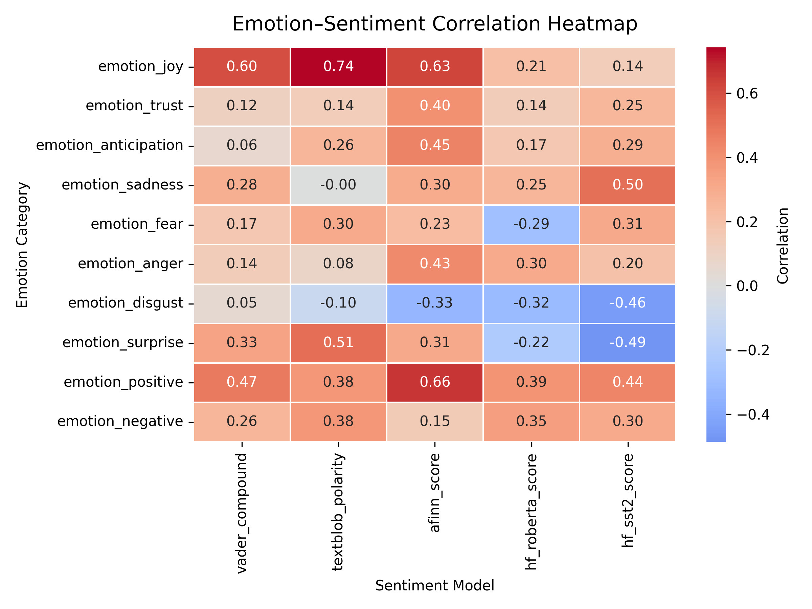
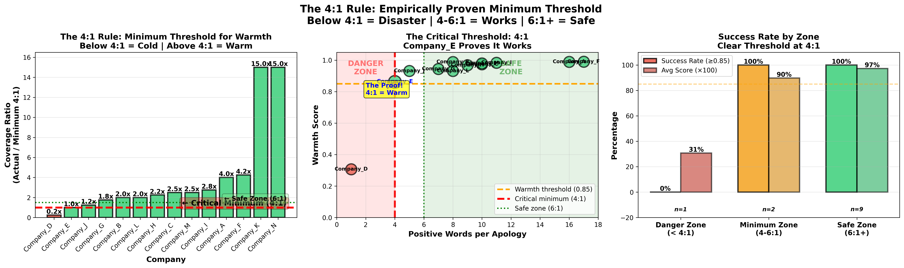
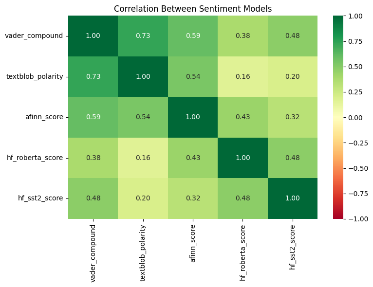
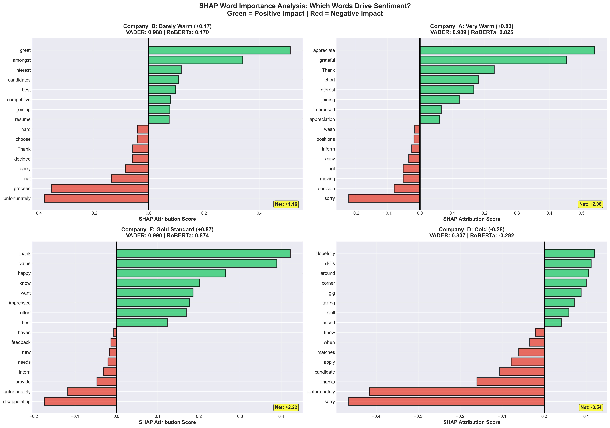
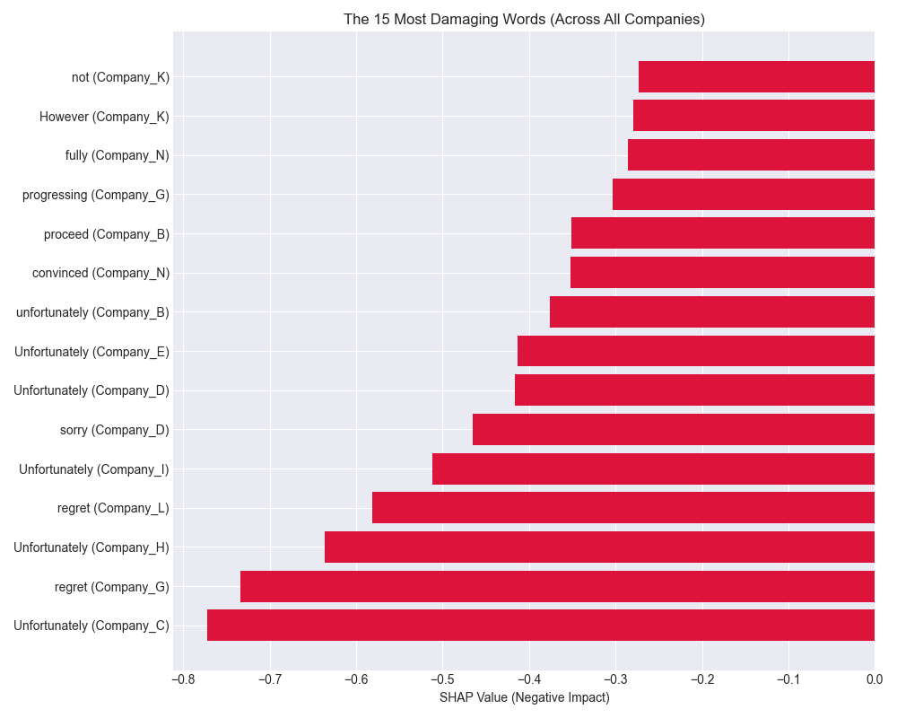
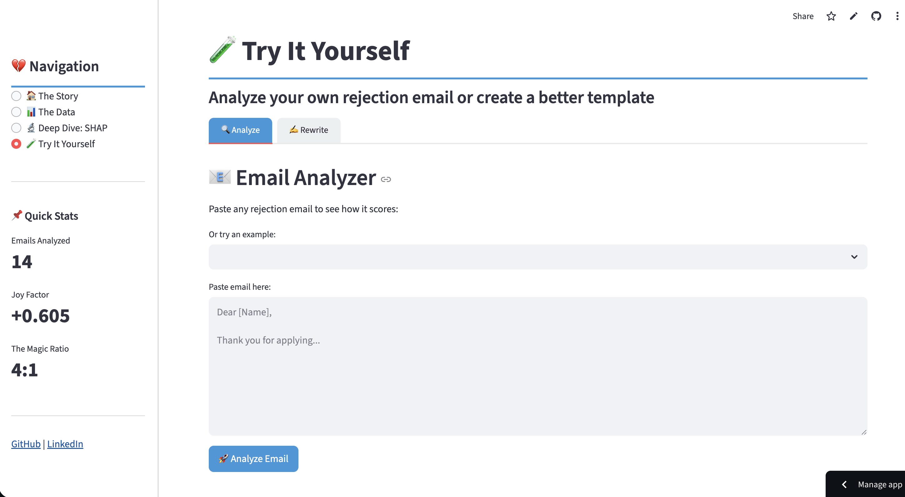

# The Language of Rejection: NLP Analysis of Job Rejection Emails


> An exploratory analysis revealing how AI sentiment models interpret professional rejection communication - and what separates algorithmically "warm" rejections from genuinely empathetic ones.

---

## 🎯 TL;DR

**Key Findings:**

- **Joy words predict warmth**: "Hope," "wish," "best" correlate **+0.605** with sentiment (5× stronger than trust, 10× stronger than anticipation)
- **The 4:1 rule**: Each apology needs **minimum 4 positive words** to maintain warmth (6:1 is optimal)
- **Transformers > Lexicons**: Context-aware models detect rejection patterns lexicons miss

**Dataset:** Real rejection emails analyzed with VADER, RoBERTa, emotion lexicons, and SHAP.

⚠️ **Living project**: New rejection emails will be added over time. Findings may evolve as the dataset grows.

---

## 💡 Why I Did This

After receiving many job rejections, I noticed patterns: some emails felt respectful, others dismissive, some never replied at all. As someone studying data science, I wondered: **could I quantify what makes a rejection feel "warm" or "cold"?**

This project started as personal (processing rejection through data) and evolved into a technical exploration (revealing fundamental limitations in how AI interprets human communication).

---

## 📧 A Note on Automated Rejections

**Reality check:** Most rejection emails are automated or templated. And that's okay.

This analysis doesn't expect recruiters to hand-craft every rejection. At scale, that's impossible. However, **automation doesn't have to mean coldness.**

**Why This Matters**: Your emails aren't just being read by humans anymore. Understanding which phrases feel warm to both humans and AI can help craft communications that are effective, readable, and positively received.

---

## 📊 What I Discovered

### Finding #1: Joy Words Are Everything


_Figure 1: Strong correlation between joy-based emotion words and overall sentiment score._

**Discovery:** Joy-based emotion (NRC lexicon) is the strongest predictor of sentiment (r = +0.605). 5× stronger than trust (+0.116), 10× stronger than anticipation (+0.057)

**What are joy words?**

- "hope", "wish", "best", "luck", "happy", "good", "encourage"
- Measured using NRC Emotion Lexicon

---

### Finding #2: The Magic Number is 4

Rejection emails need **at least 4 positive words** to feel warm.

#### The Three Zones

| Zone             | Ratio | Success Rate  | Examples               |
| ---------------- | ----- | ------------- | ---------------------- |
| **Danger Zone**  | < 4:1 | 0% (all cold) | Company_D: 1:1 → 0.307 |
| **Minimum Zone** | 4-6:1 | 100% warm     | Company_E: 4:1 → 0.863 |
| **Safe Zone**    | 6:1+  | 100% warm     | Company_B: 8:1 → 0.988 |


_Figure 2: Sentiment scores increase sharply once the positive-to-apology word ratio exceeds 4:1._

#### How I Calculated It

**Method 1: Linear Regression**

```
Sentiment = 0.825 + (0.025 × Positives) - (0.154 × Apologies)

Each apology: -0.154 impact
Each positive: +0.025 impact
Breakeven ratio: 0.154 ÷ 0.025 = 6.2:1
```

**Method 2: Empirical Threshold**

- Company_D at 1:1 → 0.307 (cold)
- Company_E at 4:1 → 0.863 (warm) ← **First warm email**
- All emails 6:1+ → 0.93+ (very warm)

**Method 3: Correlation Optimization**

- Tested ratios 1:1 through 10:1
- Peak correlation at 6:1 (r = 0.767)
- But warmth begins at 4:1

## **Conclusion:** 4:1 is the minimum, 6:1 is optimal.

### Finding #3: The Lexicon vs Transformer Gap



_Figure 3: Correlation heatmap comparing lexicon-based models (VADER, TextBlob, AFINN) versus transformer models (RoBERTa, SST-2)._

**Discovery:** Lexicon-based models (VADER, AFINN) can be fooled by polite language, while transformer models (RoBERTa) detect the underlying rejection.

**The correlations:**

- **Within lexicons**: VADER ↔ TextBlob (0.73), VADER ↔ AFINN (0.59)
- **Within transformers**: RoBERTa ↔ SST-2 (0.48)
- **Across paradigms**: VADER ↔ RoBERTa (0.38) ⚠️ weak!

**Why lexicons fail:**

```
VADER logic:
  Count: 16 positive words, 4 negative words
  Math: 16 - 4 = +12
  Result: 0.988 (very positive!)
  Human perception: "This is clearly a rejection"
```

**Why transformers succeed:**

```
RoBERTa logic:
  Detects: "unfortunately... decided not to proceed"
  Understands: This is a rejection phrase
  Weights: Negative phrase > scattered positive words
  Result: +0.17 (barely positive)
  Human perception: "Polite but still a rejection"
```

---

### Finding #4: SHAP Reveals the Balance

**Discovery:** Using SHAP (SHapley Additive exPlanations), we can see exactly which words push sentiment up or down.

#### The Pattern: Positive Forces vs Negative Forces

The warmest emails don't just have more positives. They strategically minimize negatives.


_Figure 4: Word-level importance analysis showing which words drive RoBERTa's sentiment decisions for each email._

**The Three Outcomes:**

| Email Type               | Positive Sum | Negative Sum | Net Impact | Result                      |
| ------------------------ | ------------ | ------------ | ---------- | --------------------------- |
| **Warm** (Company F)     | +2.67        | -0.45        | **+2.22**  | Both models agree (0.99) ✅ |
| **Confused** (Company B) | +2.46        | -1.30        | **+1.16**  | VADER 0.99, RoBERTa 0.17 ⚠️ |
| **Cold** (Company D)     | +0.87        | -1.41        | **-0.54**  | Both models agree (0.31) ❌ |

### Finding #5: The Words That Kill Warmth

After analyzing SHAP values across all 14 companies, clear patterns emerged:

#### ☠️ The Most Damaging Words



_Figure 5: The 15 most damaging words across all companies, ranked by SHAP impact._
| Word | Impact | Company | Notes |
|---------------|--------:|-----------|-----------------------------------------------------------------------|
| Unfortunately | -0.7727 | Company_C | Single worst word in the dataset. Transformers associate it with rejection; a **learned rejection pattern**. |
| Regret | -0.7341 | Company_G | Sounds polite, but worse than "sorry" (-0.47) for transformers. |

### Finding #6: The Winner's Strategy (Company F Case Study)

**Why Company F scored 0.990 (warmest):**

```
POSITIVE FORCES:
  appreciate   +0.39  ← Rare but powerful
  Thank        +0.42
  value        +0.39  ← Shows genuine care
  happy        +0.26  ← Joy word
  impressed    +0.18
  Total:       +2.67  (HIGHEST in dataset)

NEGATIVE FORCES:
  disappointing -0.17  ← Smart choice! Not "sorry"
  unfortunately -0.12  ← Weak form
  Total:         -0.45  (LOWEST in dataset)

NET: +2.22 (best in dataset)
```

**The secret:** Used "disappointing" instead of "sorry" = 64% less negative!

**Result:**

- VADER: 0.990 ✅
- RoBERTa: 0.874 ✅
- Gap: 0.116 (both models agree it's warm)

---

## 💡 What This Means

### For Companies Writing Rejections

**The Template Upgrade Guide:**

✅ **DO:**

- Use "appreciate" instead of generic "thank"
- Include 2 joy words: "wish you the best" or "hope you find a great fit"
- Follow 4:1 ratio: 4 positives per 1 apology (safe zone)
- Be specific: "impressed by your approach to X" > "you're qualified"
- Use "disappointed" if acknowledging outcome (-0.17 impact)

❌ **AVOID:**

- "Unfortunately" (-0.77 impact) - skip this word entirely
- "Regret" (-0.73 impact) - worse than "sorry"
- Multiple apologies (2+ = guaranteed cold email)
- Generic praise without specifics
- Emails under 50 words

---

## 🔍 How I Did This

### Project Structure

- `data/`: Raw and processed rejection email data
- `notebooks/`: Jupyter notebooks for analysis and visualization
- `scripts/`: Python scripts for data processing
- `visualizations/`: Charts and graphs generated from the analysis
- `README.md`: This overview and summary of findings
- `app.py`: interactive dashboard application

### The Data

- 14 real rejection emails from my 2024-2025 job search
- All company names removed for privacy
- Belgium-based tech/data job applications
- Anonymized (Company A through Company N)

### The Analysis

**Phase 1: Multi-Model Sentiment Analysis**

1. **Lexicon-based**: VADER, TextBlob, AFINN
   - Rule-based, count positive/negative words
   - Fast, interpretable, but context-blind
2. **Transformer-based**: RoBERTa (cardiffnlp), DistilBERT (SST-2)
   - Context-aware, phrase understanding
   - Slower but more nuanced

**Phase 2: Feature Engineering**

- Linguistic metrics: word count, sentence count, readability
- Keyword detection: empathy words, apology words, personal pronouns
- NRC Emotion Lexicon: joy, trust, anticipation, sadness, fear, anger
- AFINN positive/negative word counts
- Boolean features: mentions future, contains feedback

**Phase 3: Explainability Analysis**

- SHAP (SHapley Additive exPlanations) for word-level attributions
- transformers-interpret library for RoBERTa explainability
- Identified which exact words drive positive vs negative predictions

---

## ⚠️ Limitations

**Small sample:** Only 14 emails. This is exploratory, not definitive.

**Paraphrased:** I rewrote emails to protect company privacy, which might have changed some details.

**Ongoing work**: As I continue collecting new job rejection emails, additional data will be incorporated to refine and validate these findings. Patterns may evolve with a larger sample, so insights here are subject to update.

## 🔮 Future Relevance

As AI increasingly becomes the “first reader” of written communications, humans will often rely on AI-generated summaries or AI-curated messages. Understanding which phrases convey warmth and positivity—both to humans and AI allows business to craft emails and content that are simultaneously empathetic, readable, and algorithmically optimized. This ensures that the communications make a strong first impression, no matter who (or what) is reading.

---

## 🎨 Interactive Dashboard

An interactive dashboard visualizing these findings is available [here](https://language-of-rejection.streamlit.app/).

