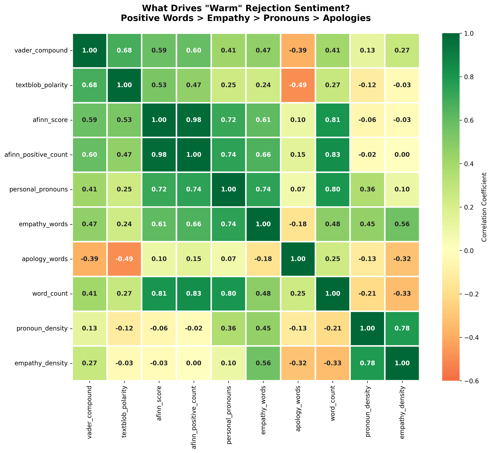

# The Language of Rejection: NLP Analysis of Job Rejection Emails


> An exploratory analysis revealing how AI sentiment models misinterpret professional rejection communication and what that tells us about the gap between algorithmic politeness detection and human empathy.

---

## 🎯 TL;DR

I analyzed real job rejection emails using sentiment analysis.

**Key finding:** AI scored rejections as 85-99% positive because algorithms reward verbose politeness over honest acknowledgment. The highest-scoring email used 15 personal pronouns. The most honest email (with 2 apologies) scored 0.31 while polite ones scored 0.89+. This explains why rejection emails feel "warm but empty."

**Note**: This analysis is based on 13 emails as of October 2025. The dataset grows with each new application response.

---

## 💡 Motivation

After receiving many job rejections, I noticed patterns: some emails felt respectful, others dismissive, some never replied at all. As someone studying data science, I wondered: **could I quantify what makes rejection feel "warm" or "cold"?**

This project is both technical (NLP feature engineering, sentiment analysis) and personal (processing rejection through data). It reveals fundamental limitations in how AI interprets human communication.

---

## 📊 Key Findings

### 1. The Apology Penalty ❌

**Apology words correlate -0.45 with sentiment** (strongest negative predictor)


_Figure 1: Correlation analysis reveals apology words are the strongest negative predictor of sentiment (-0.39), while personal pronouns drive the highest positive correlation (+0.46). Empathy words barely register (+0.19)._

Key insights:

- **Apology words (-0.39)**: Saying "sorry" or "unfortunately" significantly lowers sentiment scores
- **Personal pronouns (+0.46)**: Using "you" and "your" raises sentiment more than any other factor
- **Empathy words (+0.19)**: "Thank you" and "appreciate" barely register (2.5x weaker than personalization)
- **Both models agree**: VADER and TextBlob penalize apologies (-0.39 and -0.5 respectively)

**What this means:** 1 apology = ~2.5 personal pronouns needed to maintain AI positivity. This drives the classic corporate rejection style: long, polite, but emotionally neutral.

---

### 2. Empathy Theater 🎭

**Empathy words barely correlate with sentiment** (+0.19)

The data reveals a gap between what sounds empathetic and what algorithms detect:

- "Thank you," "appreciate," "impressed" have minimal impact on sentiment scores
- Personal pronouns ("you," "your") matter 2.5x more (+0.49 correlation)
- Email length creates illusion of warmth (word count +0.42 correlation)
- Companies increase sentiment by writing longer, not warmer

**What this means:** Words that signal care to humans are noise to algorithms. Personalization metrics (pronouns, length) matter more than actual empathy expressions.

---

### 3. The Sentiment Paradox 📈

**12 out of 13 rejection emails scored 0.85-1.0** (overwhelmingly positive), despite delivering bad news.


_Figure 2: Distribution analysis shows 12 of 13 rejection emails cluster at 0.85-1.0 sentiment (top-left histogram), with only one honest outlier at 0.31. No clear pattern exists between empathy words and sentiment scores (right-side scatter plots)._

What the distribution reveals:

- **Only 1 outlier at 0.31** - the most direct, honest rejection
- **No empathy pattern** - scatter plots show empathy words don't correlate with sentiment
- **The clustering problem** - AI interprets polite framing as positive, regardless of content
- **Why it matters** - This explains why corporate rejections feel "warm but hollow"

**The problem:** AI can't distinguish between delivering news kindly and burying bad news in positive language. Both score as "positive."

---

## 🔍 Methodology

### Data Collection

- **13 rejection emails** from real job applications (2024-2025)
- **4 ghosted applications** (no response after 30-120 days)
- All personally identifiable information anonymized
- European job market context (Belgium-based applications)

### Data Preparation

### Analysis Pipeline

1. **Text Preprocessing**: Anonymization, normalization, cleaning
2. **Sentiment Analysis**: VADER, TextBlob (cross-model validation)
3. **Feature Engineering**:
   - Linguistic features (word count, readability, pronouns)
   - Emotional markers (empathy words, apology words)
   - Structural patterns (mentions future, contains feedback)
4. **Statistical Analysis**: Correlation analysis, distribution comparison, outlier detection
5. **Visualization**: Heatmaps, scatter plots, pairplots

### Key Features Extracted

```python
# Automatically calculated from email text
- email_length, word_count, sentence_count
- vader_compound, textblob_polarity
- personal_pronouns (you, your, yours)
- empathy_words (thank, appreciate, hope, impressed, grateful, wish)
- apology_words (sorry, unfortunately, regret, apologies, apologize)
- mentions_future (boolean)
- contains_feedback (boolean)
- flesch_reading (readability score)
```

---

## 📈 Detailed Results

### Company Strategy Comparison

Real examples from the dataset demonstrate how language choices dramatically affect sentiment scores:

| Company | Strategy            | Sentiment  | Length (chars) | Pronouns | Apologies | Key Characteristic                |
| ------- | ------------------- | ---------- | -------------- | -------- | --------- | --------------------------------- |
| **F**   | Highly personalized | **0.9898** | 945            | **15**   | 1         | Most pronouns = highest score     |
| **A**   | Warm & detailed     | 0.9894     | 1023           | 13       | 1         | Second-most pronouns              |
| **C**   | Standard polite     | 0.9739     | 897            | 10       | 1         | Long + moderate pronouns          |
| **K**   | Brief, no apology   | 0.8860     | 265            | **2**    | **0**     | Zero apologies but low pronouns   |
| **D**   | Honest (outlier)    | **0.3071** | 422            | 4        | **2**     | Apologies + low pronouns = lowest |

**Key patterns:**

1. **Top 5 companies**: All used 8-15 pronouns and scored 0.97-0.99
2. **Bottom 3 companies**: All used 2-4 pronouns and scored below 0.89
3. **The outlier (Company D)**: Only email with 2+ apologies, scored dramatically lower
4. **The paradox (Company K)**: Zero apologies but still scored low due to only 2 pronouns

**Insight:** Personalization (pronouns) drives sentiment more than apology avoidance. Company F with 1 apology scored 0.9898 because it had 15 pronouns. Company K with 0 apologies scored only 0.8860 because it had just 2 pronouns.

---

### Example 1: Highest Sentiment (0.9898) - Company F

**Characteristics:**

- 945 characters (long, detailed)
- **15 personal pronouns** - highest in dataset
- 5 empathy words (thank, appreciate, etc.)
- Only 1 apology word
- Mentions future opportunities: Yes

**Why it scored highest:**
The algorithm detected maximum personalization through pronoun density. Every "you" and "your" signals individual attention to the model, even if the underlying message is generic. Combined with length (945 chars) and future-orientation, this created the "warmest" algorithmic reading.

**The irony:** This email may or may not have been genuinely personalized but it was algorithmically optimized for sentiment scoring.

**Pattern:** High pronouns + Length + Future mention + Minimal apologies = Maximum AI "warmth"

---

### Example 2: The Outlier (0.3071) - Company D

**Characteristics:**

- 422 characters (medium length)
- 4 personal pronouns (low)
- 2 empathy words
- **2 apology words** (tied for highest)
- Direct acknowledgment: "We're sorry, but you haven't been selected. Unfortunately, the hiring team has decided to move forward with another candidate..."

**Why it scored lowest:**
Double penalty from the algorithm's perspective:

1. **Direct acknowledgment** of disappointment through apologies ("sorry" + "unfortunately")
2. **Lower personalization** - only 4 pronouns compared to 8-15 in high-scoring emails

**The irony:** This was the most honest rejection - it acknowledged disappointment directly. The algorithm punished this honesty, scoring it 0.31 while polite-but-evasive emails scored 0.89+.

**Pattern:** Honesty (apologies) + Low personalization (few pronouns) = Dramatic sentiment penalty

---

### Example 3: The No-Apology (0.8860) - Company K

**Characteristics:**

- 265 characters (shortest in dataset)
- **2 personal pronouns** (lowest in dataset)
- 1 empathy word
- **0 apology words** (avoided apologizing entirely)
- Brief and factual

**Why this matters:**
Company K strategically avoided apologies but still scored relatively low (0.8860) compared to the top scorers (0.97-0.99). This proves that **avoiding apologies alone doesn't guarantee high sentiment** - you need high personalization (pronouns) and length.

**The revelation:**

- Company K: 0 apologies + 2 pronouns = 0.8860
- Company F: 1 apology + 15 pronouns = 0.9898

**Conclusion:** Personalization matters MORE than apology avoidance. Adding pronouns increases sentiment more than removing apologies.

**Pattern:** Low pronouns = Lower sentiment, regardless of apology strategy

---

### The Formula for High-Sentiment Rejection

After analyzing the dataset, a clear pattern emerged for what makes rejection emails score as "warm" to AI.

#### **What AI Detects as "Warm":**

**Personal pronouns** This matters more than any other factor because algorithms interpret pronoun density as personalization, even when the content is generic.

**Length creates an illusion of care.** Longer emails (800+ characters) consistently scored higher than brief ones. More words mean more opportunities for positive language, making the rejection feel more thoughtful to the algorithm.

**Future-oriented language acts as optimism.** Phrases like "keep in touch" and "future opportunities" signal forward-looking positivity, boosting sentiment scores.

#### **What AI Penalizes:**

**Honest acknowledgment of disappointment.** Words like "sorry" and "unfortunately" are the strongest negative predictor of sentiment. The one email with 2 apology words scored dramatically lower than all others not because it was cold, but because it was honest.

**The irony:** The most truthful rejection scored lowest.

#### **The Surprising Paradox:**

One company avoided apologies entirely but still scored relatively low because it used very few personal pronouns and was brief. Another company used an apology but scored highest because it had maximum personalization and length.

**The lesson:** Personalization (or the appearance of it) matters more than avoiding apologies.

#### **The Optimized Rejection Formula:**

To score as "warm" to AI sentiment models:

- 8-15 personal pronouns throughout ("you," "your")
- 800-1000 characters
- Minimize apologies (0-1 maximum)
- Close with future-oriented language
- Empathy words are surprisingly optional

**The gap:** What algorithms detect as "warmth" (pronouns, length, optimism) isn't the same as what humans experience as empathy (acknowledgment, honesty, respect for their time).

---

## 🛠️ Tech Stack

- **Python** 3.9+
- **NLP & Sentiment Analysis**:
  - vaderSentiment (3.3.2) - Rule-based sentiment analysis
  - TextBlob (0.17.1) - Pattern-based sentiment analysis
  - NLTK - Natural language toolkit
- **Data Processing**: Pandas, NumPy
- **Visualization**: Matplotlib, Seaborn
- **Statistical Analysis**: SciPy
- **Development**: Jupyter Notebook

---

## ⚠️ Limitations

### Sample Size

- **Small dataset (13 emails)** limits statistical generalizability
- Results should be considered exploratory and hypothesis-generating
- Patterns observed may not hold across larger samples or different contexts

### Scope Constraints

- **Geographic**: European job market only (Belgium-based applications)
- **Industry**: Primarily tech/analytics/data positions
- **Language**: English language only
- **Timeframe**: 2024-2025 (post-COVID job market)
- **Position level**: Junior to mid-level roles

### Methodological Limitations

- **Sentiment models trained on general text**, not rejection-specific language
- **No ground truth for "warmth"** - relies on algorithmic interpretation, not human ratings
- **Self-reported data** - emails from personal experience may have selection bias

---

## 📝 Ethical Considerations

- **Privacy**: All personal identifiers removed (names, companies, employee names, email addresses)
- **Anonymization**: Company names replaced with generic labels, content paraphrased
- **Purpose**: Educational and research use only
- **Consent**: Personal data from own inbox used for self-analysis
- **Transparency**: Full methodology documented for reproducibility
- **No harmful applications**: Results not intended for automated hiring/firing decisions

---

## 📚 References

- [VADER Sentiment Analysis](https://github.com/cjhutto/vaderSentiment)
- [TextBlob Documentation](https://textblob.readthedocs.io/)
- [NLTK: Natural Language Toolkit](https://www.nltk.org/)

---

## 🌟 Acknowledgments

- Thanks to all the companies that sent rejection emails (this project wouldn't exist without you)
- The open-source NLP community for excellent tools and libraries
- Everyone processing job rejection through creative analytical means

---

_"The algorithm doesn’t measure emotional warmth — it measures linguistic patterns of politeness. That’s why many rejection emails sound courteous, yet still feel emotionally distant."_

---
