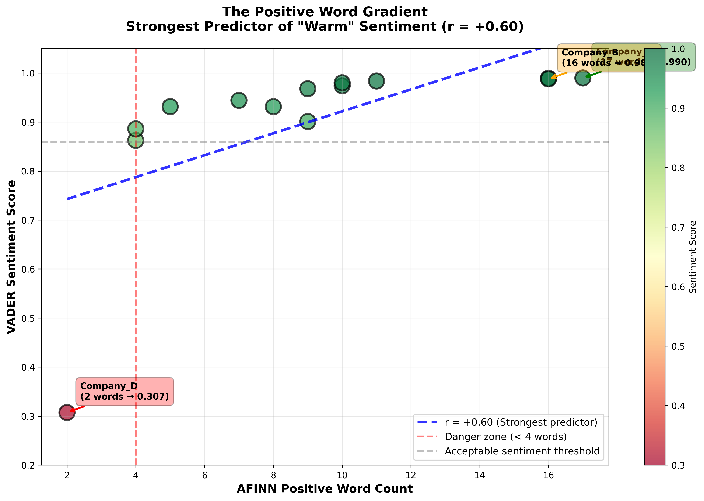
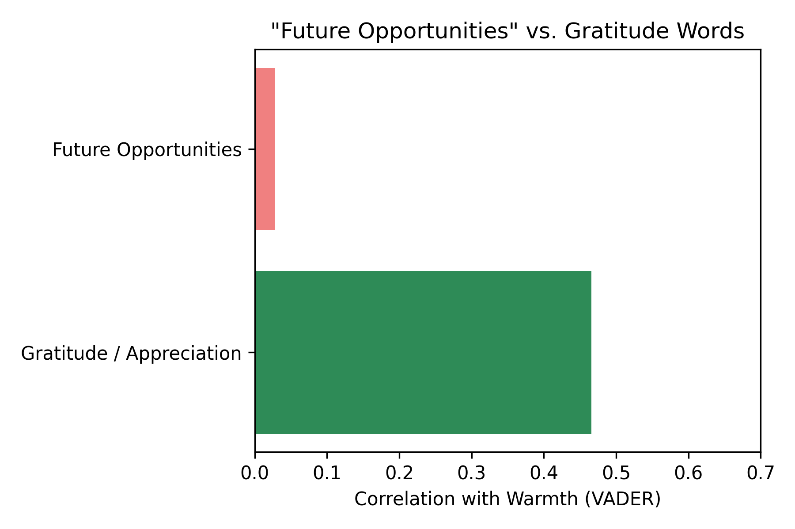

# The Language of Rejection: NLP Analysis of Job Rejection Emails


> An exploratory analysis revealing how AI sentiment models interpret professional rejection communication - and what separates algorithmically "warm" rejections from genuinely empathetic ones.

---

## 🎯 TL;DR

Analyzed job rejection emails using multiple NLP approaches (lexicon-based + transformers + emotion analysis + SHAP).

- **Joy words drive warmth**: Emails with 2+ joy words (hope, happy, good luck) → 0.95+ (warm). Emails with 0 joy words → 0.31 (cold).

- **Negative phrases matter**: "Unfortunately… not proceed" (-0.73 combined impact) needs 5+ strong positive words to maintain warmth.

- **Practical rule of thumb**: Warmth ≈ (Joy words × 2) + Positive words − (Apologies × 3)

- **Lexicon vs transformer gap**: Lexicons can be fooled by polite words; transformers detect underlying rejection.

⚠️ **Ongoing work**: New rejection emails will be added over time to refine and validate these patterns. Scores and insights may evolve as the dataset grows.

---

## 💡 Why I Did This

After receiving many job rejections, I noticed patterns: some emails felt respectful, others dismissive, some never replied at all. As someone studying data science, I wondered: **could I quantify what makes rejection feel "warm" or "cold"?**

This project started as personal (processing rejection through data) and evolved into technical exploration (revealing fundamental limitations in how AI interprets human communication).

---

## 📊 What I Discovered

### Finding #1: Joy Words Are Everything


_Figure 1: Strong correlation between joy-based emotion words and overall sentiment score._

**Discovery:** Joy-based emotion (NRC lexicon) is the strongest predictor of sentiment (r = +0.65), surpassing even comprehensive positive word counts.

| Email Has   | Sentiment Score | Feels Like                |
| ----------- | --------------- | ------------------------- |
| 2 joy words | 0.95-0.99       | Genuinely warm ✅         |
| 1 joy word  | 0.88-0.95       | Professional but standard |
| 0 joy words | 0.31            | Cold and harsh ❌         |

**What are "joy words"?**

- good, luck, hope, encourage, happy, appreciation, proud, organization, providing, journey

---

### Finding #2: The Magic Number is 4

Rejection emails need **at least 4 positive words** to feel warm.

**What I found:**

- 15+ positive words → 0.99 score (top warmth)
- 10 positive words → 0.95 score (warm)
- 4-5 positive words → 0.88 score (okay)
- **2 positive words → 0.31 score** (falls off a cliff!)



---

### Finding #3: It's About Balance

**Discovery:** Using SHAP (SHapley Additive exPlanations) on transformer models reveals **why** some rejections feel warm and others don't - it's about the net balance of positive vs negative word forces.


_Figure 3: Word-level importance analysis showing which words drive RoBERTa's sentiment decisions for each email._

#### **Case Study 1: Company B (+0.17) - The Tipping Point**

```
POSITIVE forces:
  great        +0.51  ✓
  amongst      +0.34  ✓
  candidates   +0.16  ✓
  best         +0.10  ✓
  Total:       +1.11

NEGATIVE forces:
  unfortunately -0.38  ✗
  proceed      -0.35  ✗
  not          -0.13  ✗
  sorry        -0.08  ✗
  Total:       -0.94

NET: +1.11 - 0.94 = +0.17 → Barely positive
```

**The problem:** Despite having positive words, the phrase "unfortunately, we decided not to proceed" carries massive negative weight (-0.86 combined). Positive words BARELY overcome this.

**Case Study 2: Company F: Very Warm (scored 0.96)**

```
Positive words pushing UP:
  "thank" → +0.42 points
  "value" → +0.39 points
  "happy" → +0.26 points
  "impressed" → +0.18 points
  Total positive: +1.25

Negative words pushing DOWN:
  "disappointing" → -0.17 points
  "unfortunately" → -0.12 points
  Total negative: -0.29

NET: +1.25 - 0.29 = +0.96 → Very positive
```

**The strategy:** Floods with strong positive words (5 major ones) that OVERWHELM the weak negatives. Uses "disappointed" instead of "sorry" (less negative weight).

---

### Finding #4: "Future Opportunities" Doesn't Help Much

**Surprising discovery:** Mentioning "future opportunities" or "keep in touch" barely affects warmth.


_Figure 4: compares the impact of “future-oriented” words versus gratitude-related words on perceived warmth of rejection emails._

**Weak words (correlation +0.10):**

- "future openings"
- "keep in touch"
- "apply again"

**Strong words (correlation +0.65):**

- "thank you"
- "appreciate"
- "good luck"
- "hope"

**Why?** AI (and probably humans) care more about how you treat them NOW, not promises about the future.

---

### Finding #5: Apologies Can Be Overcome


_Figure 5: Show the “impact ratio” of positive words relative to negative apology words in rejection emails."_

**The data:**

- Company D: 2 apologies + 2 positive words = 0.31 (disaster)
- Company B: 2 apologies + 16 positive words = 0.99 (lexicon fooled) but only 0.17 RoBERTa (transformer sees through it)

**The rule:** Each "sorry" or "unfortunately" needs about 3 positive words to cancel it out.

---

### Finding #6: The Lexicon vs Transformer Gap


_Figure 6: Correlation heatmap comparing lexicon-based models (VADER, TextBlob, AFINN) versus transformer models (RoBERTa, SST-2)._

**Discovery:** Lexicon-based models (VADER, AFINN) can be fooled by polite language, while transformer models (RoBERTa) detect the underlying rejection.

**The correlations:**

- **Within lexicons**: VADER ↔ TextBlob (0.73), VADER ↔ AFINN (0.59)
- **Within transformers**: RoBERTa ↔ SST-2 (0.48)
- **Across paradigms**: VADER ↔ RoBERTa (0.38) ⚠️ weak!

**Why lexicons fail:**

```
VADER logic:
  Count: 16 positive words, 4 negative words
  Math: 16 - 4 = +12
  Result: 0.988 (very positive!)
```

**Why transformers succeed:**

```
RoBERTa logic:
  Detects: "unfortunately... decided not to proceed"
  Understands: This is a rejection phrase
  Weights: Negative phrase > scattered positive words
  Result: +0.17 (barely positive, closer to human perception)
```

## 🔍 How I Did This

### The Data

- 13 real rejection emails from my 2024-2025 job search
- 4 applications that ghosted me (never replied)
- All company names removed for privacy
- Belgium-based tech/data job applications

### The Analysis

**Phase 1: Multi-Model Sentiment Analysis**

1. **Lexicon-based**: VADER, TextBlob, AFINN
   - Rule-based, count positive/negative words
   - Fast, interpretable, but context-blind
2. **Transformer-based**: RoBERTa (cardiffnlp), DistilBERT (SST-2)
   - Context-aware, phrase understanding
   - Slower but more nuanced

**Phase 2: Feature Engineering**

- Linguistic metrics: word count, sentence count, readability
- Keyword detection: empathy words, apology words, personal pronouns
- NRC Emotion Lexicon: joy, trust, anticipation, sadness, fear, anger
- AFINN positive/negative word counts
- Boolean features: mentions future, contains feedback

**Phase 3: Explainability Analysis**

- SHAP (SHapley Additive exPlanations) for word-level attributions
- transformers-interpret library for RoBERTa explainability
- Identified which exact words drive positive vs negative predictions

---

## 📈 The Three Types of Rejection Emails

### Type 1: "The Warm One" (Score: 0.95-0.99)

**Recipe:**

- 2+ joy words (hope, happy, encourage)
- 15+ positive words total
- 10+ times saying "you" or "your"
- Long email (800-1000 words)
- Only 0-1 apology

**Example structure:**
_"Thank you for your interest [joy]. We appreciate your time and effort [empathy]. We were impressed with your qualifications [positive]. We hope our paths cross in the future [joy + future]. We'd be happy to consider you for other roles [positive]. Best wishes [joy]!"_

**Effect:** Algorithmically warm, feels genuinely thoughtful

---

### Type 2: "The Standard Professional" (Score: 0.86-0.94)

**Recipe:**

- 1 joy word (usually just "good luck")
- 7-10 positive words
- Moderate length (400-600 words)
- 1 apology

**Example structure:**
_"Thank you for applying. Unfortunately, we won't be moving forward at this time. We wish you the best of luck."_

**Effect:** Feels professional but somewhat formulaic

---

### Type 3: "The Cold One" (Score: 0.31-0.86)

**Recipe:**

- 0-1 joy words (or very weak ones)
- Only 2-4 positive words
- 2 apologies with no compensation
- Short (200-400 words)

**Example structure:**
_"Thanks for applying. Sorry, but you weren't selected. Unfortunately, we're going with another candidate."_

**Effect:** Feels cold and dismissive, despite being polite

---

## 💡 What This Means

### For Job Seekers (That's Me!)

- **Don't take it personally** - "warmth" is often just following a template
- **Red flag**: Email with 0 joy words and 2+ apologies = they didn't try
- **Green flag**: 2+ joy words and personal details = they actually care

### For Companies Writing Rejections

**Want to make rejections feel warmer? Here's the cheat sheet:**

✅ **Do this:**

- Say "thank you" and "appreciate" (not just "thanks")
- Use "hope" and "happy"
- End with "good luck" or "best wishes"
- Aim for 800+ characters
- Say "you" and "your" at least 10 times

❌ **Avoid this:**

- Using "sorry" and "unfortunately" together (double negative!)
- Being too brief (under 400 characters)
- Only 1-2 positive words total
- No joy words at all

**The magic formula:**

```
Warmth = (Joy words × 2) + Positive words - (Apologies × 3)

Example:
- 2 joy words = +4
- 10 positive words = +10
- 1 apology = -3
Total = +11 → Warm email!
```

---

## 🛠️ Technical Details

**Tools I used:**

- Python for all analysis
- VADER, TextBlob, AFINN for basic sentiment
- RoBERTa transformer model for smart AI analysis
- NRC Emotion Lexicon for emotion detection
- SHAP for explaining which words matter
- Matplotlib/Seaborn for charts

---

## ⚠️ Limitations

**Small sample:** Only 13 emails. This is exploratory, not definitive.

**Paraphrased:** I rewrote emails to protect company privacy, which might have changed some details.

**Ongoing work**: As I continue collecting new job rejection emails, additional data will be incorporated to refine and validate these findings. Patterns may evolve with a larger sample, so insights here are subject to update.
